<div align="center">

# PokeDev

### Seu calendário de contribuições virou um card pixel art.

Um gerador de SVG animado que transforma a atividade pública do GitHub em uma experiência inspirada em jogos retrô — com Charizard, níveis, XP e dados reais.

[](https://github.com/higormanoel/pokedev/actions)
[](./LICENSE)

</div>



## O projeto

O PokeDev consulta os dados públicos de contribuição do GitHub e gera um card em SVG, pronto para ser usado no README do perfil. O resultado inclui:

- commits públicos, contribuições e dias ativos dos últimos 12 meses;
- calendário diário com intensidade baseada na atividade;
- nível e barra de XP calculados a partir dos commits;
- Charizard desenhado em pixel art diretamente no SVG;
- olhar alternando entre frente e lado;
- chama da cauda animada em dois quadros;
- atualização automática diária com GitHub Actions;
- modo de movimento reduzido para acessibilidade.

Somente as pupilas e a chama são animadas. O personagem e o restante da interface permanecem estáticos.

## Usar no seu perfil

Faça um fork ou copie o projeto, ajuste o usuário e execute:

```bash
GITHUB_USERNAME=seu-usuario node scripts/generate-pokedev.mjs
```

Depois, adicione o card ao seu README:

```html

```

O workflow em `.github/workflows/update-card.yml` regenera o arquivo diariamente. O token automático do GitHub Actions permite ler os dados do dono do repositório e publicar a nova versão do SVG.

## Estrutura

```text
pokedev/
├── .github/workflows/update-card.yml
├── assets/pokedev-card.svg
├── scripts/generate-pokedev.mjs
├── LICENSE
└── README.md
```

## Autoria

Conceito, direção visual e desenvolvimento por [Higor Manoel](https://github.com/higormanoel).

Este é um projeto independente de fã, sem associação com Nintendo, Game Freak, Creatures Inc. ou The Pokémon Company. Pokémon e Charizard são marcas de seus respectivos titulares.

## Licença

O código original deste repositório está disponível sob a [licença MIT](./LICENSE). Personagens e marcas citados não fazem parte dessa licença.
